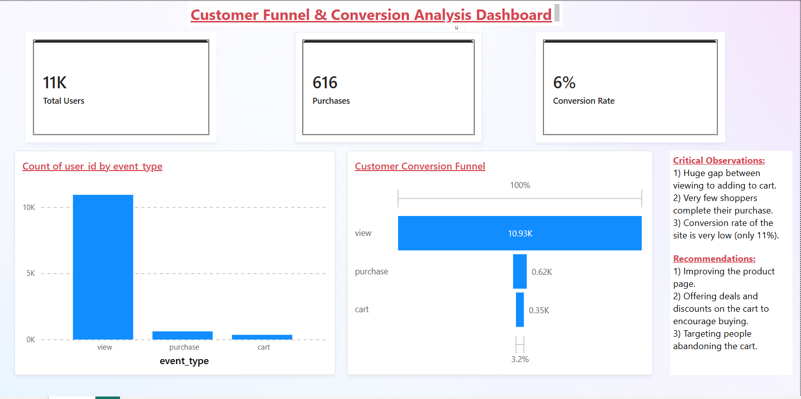

-Customer Funnel & Conversion Analysis Dashboard

-Overview

This project analyzes user behavior across an e-commerce funnel using Power BI.
It focuses on understanding how users move through the stages from viewing a product to completing a purchase.

The analysis helps identify drop-off points in the funnel and highlights areas where conversion can be improved.

-Objective

Analyze the customer journey across funnel stages
Identify where users drop off
Measure conversion performance
Provide actionable recommendations to improve conversions

- Tools Used
Power BI
CSV Dataset (sample of 50,000 rows)

-Key Metrics

Total Users: 11k
Purchases: 616
Conversion Rate: 6%

-Dashboard Features

Funnel visualization showing View → Cart → Purchase stages
KPI cards for key business metrics
Drop-off analysis across funnel stages
User distribution visualization

-Key Insights

There is a significant drop-off between the view and cart stages
Only a small percentage of users complete purchases
The overall conversion rate is relatively low (around 11%)

-Recommendations

Improve the product page experience to increase engagement
Provide incentives such as discounts at the cart stage
Retarget users who abandon the funnel

-Dashboard Preview

-Note

The dataset has been reduced to 50,000 rows for performance optimization and GitHub upload limits.

-Conclusion

This project demonstrates how funnel analysis can be used to understand user behavior and identify opportunities to improve conversion rates in an e-commerce setting.
